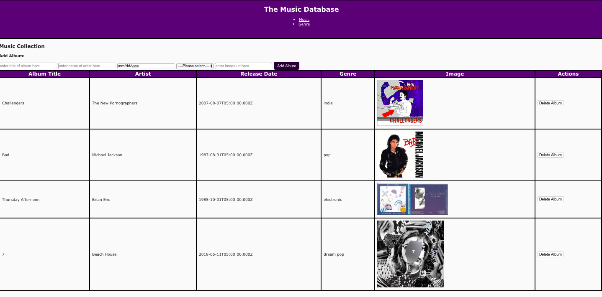
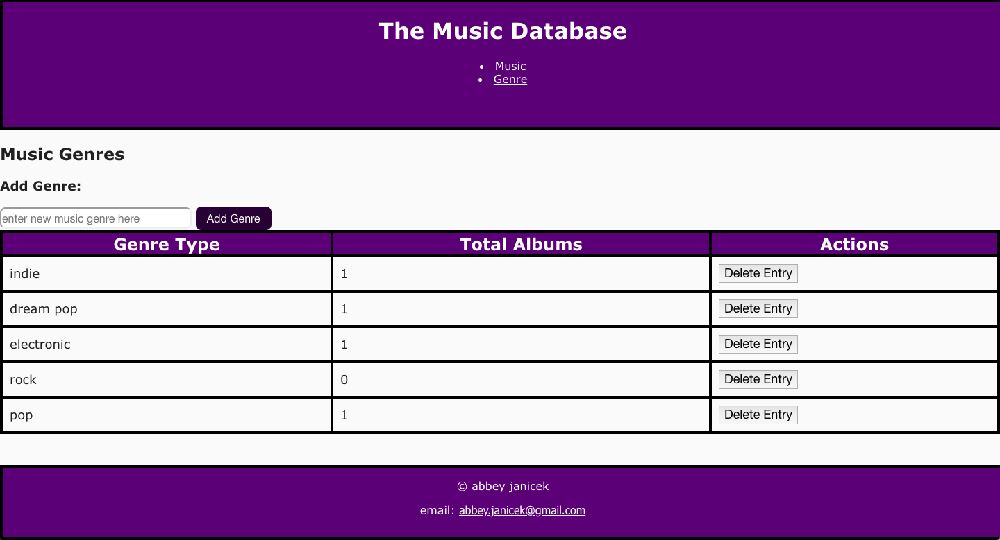

# Music Collection Project

Trello Board: https://trello.com/b/syo6Yufh/music-collection-weekend-project

## Features

- Add genres
- Add movies by name, absolute image URL, release date, genere and run time
- Remove movies
- Delete existing entries
- Show total number of movies next to each genre

### Wireframes

#### Add Music View

#### Manage Genres View

### Database

Tables: 

**music**

CREATE TABLE "music" (

	"id" serial primary key,

	"title" varchar(80) not null,

	"artist" varchar(80) not null,

	"release_date" date,

	"genre_id" integer not null,

	"image_url" varchar(20000)

	);

INSERT INTO "music" ("title", "artist", "date", "genre") VALUES ('Challengers', 'The New Pornographers', 08-07-2007, 'indie rock');

**genre**

CREATE TABLE "genre" (

	"id" serial primary key,

	"type" varchar(20) not null

);

INSERT INTO "genre" ("type") VALUES ('indie rock');

## Stretch Goals

- Angular Material for design
- Ability to edit genres or movies
- Ability to search or filter by name or genre
- Vote up or down a movie
- Ability to favorite a movie and display favorites on a separate route
- Feel free to deviate from this list and add features of your own